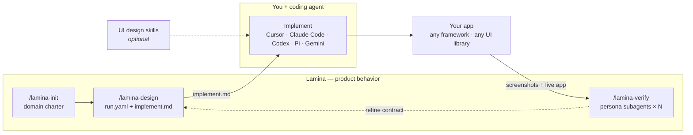

<p align="center">
  
</p>

<p align="center"><em>Design is how it works — not just how it looks.</em></p>

<p align="center"><strong>Know what to build. Iterate faster.</strong></p>

<p align="center">
  Open-source skill for AI coding agents. Lamina designs how your app works — edge cases, product states, UX gaps — in a contract your agent implements. Then verifies what you shipped by spawning <strong>one subagent per persona</strong> to walk your live app in parallel. Any stack. Never writes app source.
</p>

---

## Install

```bash
npx skills add https://github.com/aryaniyaps/lamina -a cursor -a claude-code -a codex -a pi -y
```

---

## How it works

Your coding agent writes app source. Optional UI design skills (Impeccable, UI UX Pro Max, etc.) handle look and feel. **Lamina handles product behavior** — what to build, how states and flows work, which edge cases to cover — in a loop around implementation:



| Step | Who | Output |
|------|-----|--------|
| 1. Charter + design | **Lamina** | `.lamina/runs/<id>/run.yaml`, `implement.md` |
| 2. Build | **Your coding agent** | App source — any stack |
| 3. Verify | **Lamina** | Parallel persona walks, findings, visual walkthrough, invariant checks |

---

## Pair with

Lamina designs and verifies product behavior. It works best when your agent can **see the whole system cheaply** and **remember what you already decided**. Add these to your coding stack:

| Tool | Why it helps Lamina |
|------|---------------------|
| **[Graphify](https://github.com/safishamsi/graphify)** | Most flows span many files. Graphify turns the repo into a queryable knowledge graph so your agent maps routes, callers, and architecture without burning tokens on grep-walks. Run `/graphify .` before `/lamina-design` or `/lamina-verify` on brownfield apps. |
| **[Claude-Mem](https://github.com/thedotmack/claude-mem)** | Design → build → verify spans sessions. Claude-Mem keeps decisions, prior findings, and project context across chats so you don't re-explain the domain every time. |
| **UI design skill** ([Impeccable](https://github.com/pbakaus/impeccable), UI UX Pro Max, `frontend-design`) | Lamina stays unopinionated on pixels. Pair a UI skill so implementation looks intentional while Lamina owns states, edges, and verify. |
| **Spec Kit / Kiro** | After `/lamina-design`, feed `implement.md` into an engineering spec for task breakdown. Product contract first, then build plan. |

**Minimum upgrade for brownfield:** Graphify (codebase map) + Claude-Mem (session continuity). Lamina then designs against real structure and verifies without rediscovering the app every turn.

---

## Why not …?

Developers often reach for tools that solve adjacent problems. Most are complementary — UI skills for pixels, product/UX skills for craft, Lamina for the contract and verify loop. If you're comparing, here's where each fits.

### Impeccable, UI UX Pro Max, or `frontend-design`

**They polish how it looks** — design languages, palettes, typography, anti-slop rules, and component aesthetics.

**Lamina designs how it works** — actors and permissions, flows, empty/error/loading states, business invariants, concurrency edges. Many teams run both: UI skill on implementation, Lamina on the contract and verify loop.

### BMAD, ai-ux-skills, design-skills, or other product/UX skills

**They teach design judgment** — heuristics, critique frameworks, accessibility checklists, PRDs, journey maps, and UX writing. Collections like [BMAD](https://github.com/bmad-code-org/BMAD-METHOD), [ai-ux-skills](https://github.com/firassb/ai-ux-skills), and [design-skills](https://github.com/cuellarfr/design-skills) activate when relevant and improve how your agent *thinks* about design.

**Lamina runs a product-design workflow** — slash commands that produce a structured contract (`run.yaml`, `implement.md`), then verify what you shipped against it. Reference skills don't encode domain invariants, actor permissions, or multi-step failure modes into an implementable artifact, and none walk your live app after build. Use both: product/UX skills for craft and critique; Lamina when you need a contract your agent implements and a verify pass that catches gaps.

### Just asking your coding agent

Works for happy paths. Weak on permission matrices, stale-data states, and product rules that only surface after you ship ("payment fails mid-checkout — now what?").

Lamina adds structure before build (`run.yaml`, `implement.md`) and checks after (`/lamina-verify` walks the live app with actor simulations and invariant probes). You keep your agent; Lamina adds the product-design layer it skips.

### Spec Kit, Kiro, or spec-driven dev

**Complementary — product first, then spec.** Spec Kit and Kiro structure engineering work: requirements, plans, tasks, constitution. Lamina structures product behavior: actors, workflows, scenarios, invariants.

Better order: run `/lamina-design` to nail what the product must do (`run.yaml`, `implement.md`), then feed that into Spec Kit or Kiro for the implementation plan. Starting with an engineering spec skips the product layer — you get well-specified code for behavior nobody designed. Lamina also verifies the shipped app; spec tools don't walk your live UI.

### v0, Lovable, or Bolt

**They generate apps** — often full-stack, often locked to their stack and hosting. Fast for weekend MVPs.

Lamina doesn't generate code or replace your IDE. It fits developers who already build in their own repo with Cursor, Claude Code, or Codex — any framework. AI builders tend to struggle with role hierarchies, multi-step workflows, and domain edge cases; that's what Lamina's contract + verify loop targets.

### Figma or design handoff

Mocks show one screen at a time. They don't ship as agent instructions, don't systematically cover edge cases, and don't verify what got built.

Lamina outputs `implement.md` your agent follows, then audits the live product against the contract. Figma and Lamina can coexist — Lamina is the behavioral spec for agent-native builds.

**Choose Lamina** when you build with a coding agent, care about product correctness (not just UI polish), and want verification before users find the gaps.

**Skip it** when you only need a landing-page skin, you're fully inside a no-code AI builder, or you don't want a `.lamina/` contract in your repo.

---

## Quickstart

```
/lamina-init Exam hall ticket system for universities
/lamina-design Hall ticket download with payment gate and venue assignment
# … build with your coding agent …
/lamina-verify
```

Output lives in `.lamina/runs/<id>/`. Hand `implement.md` to your coding agent.

---

## Commands

| Command | What it does |
|---------|--------------|
| `/lamina` | Router |
| `/lamina-init` | Domain charter |
| `/lamina-design` | Design contract → `ready_to_build` |
| `/lamina-verify` | Post-build check, persona walks, invariant checks |

Writes to `.lamina/` only. No app source. No visual styling.

---

## More

- Skill router: [`skills/lamina-core/SKILL.md`](skills/lamina-core/SKILL.md)
- Validate a run: `node lib/validate-run.mjs .lamina/runs/<id>/run.yaml`

MIT
