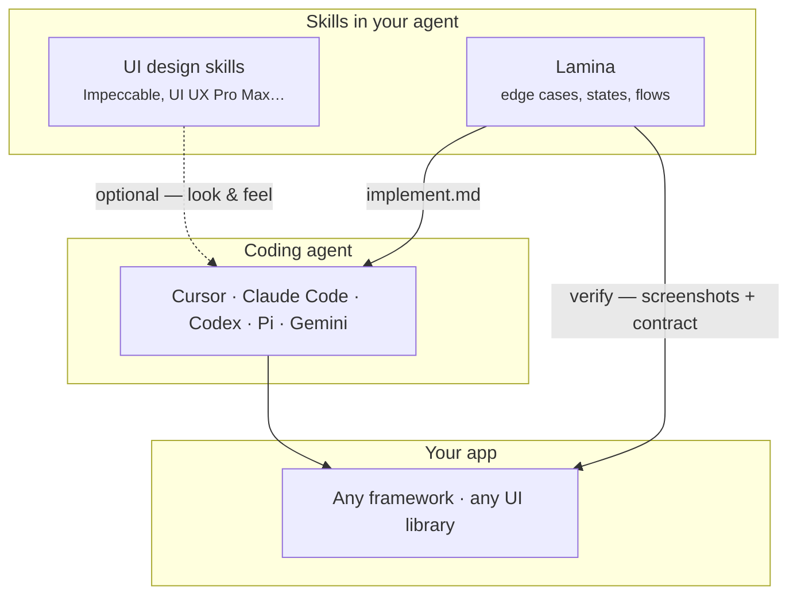
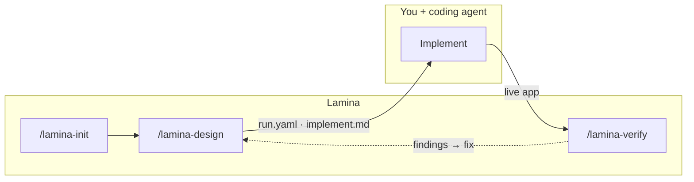

<p align="center">
  
</p>

<p align="center"><em>Design is how it works — not just how it looks.</em></p>

<p align="center"><strong>Know what to build. Iterate faster.</strong></p>

<p align="center">
  Open-source skill for developers who build with AI coding agents. Lamina designs how your app works — edge cases, product states, UX gaps — in a contract your agent implements. Then verifies what you shipped. Any stack. Never writes app source.
</p>

---

## Where Lamina fits

Your coding agent writes code. UI design skills handle pixels. **Lamina handles product behavior** — what to build, how states and flows work, what edge cases to cover — before and after your agent ships.



---

## Dev loop



| Phase | Owner | Output |
|-------|-------|--------|
| Charter + design | **Lamina** | `.lamina/runs/<id>/run.yaml`, `implement.md` |
| Build | **Your coding agent** | App source — any stack |
| Verify | **Lamina** | Findings, visual walkthrough, invariant checks |

---

## Install

```bash
npx skills add https://github.com/aryaniyaps/lamina -a cursor -a claude-code -a codex -a pi -y
```

---

## Quickstart

```
/lamina-init Exam hall ticket system for universities
/lamina-design Hall ticket download with payment gate and venue assignment
# … build with your coding agent …
/lamina-verify
```

Output lives in `.lamina/runs/<id>/`. Hand `implement.md` to your coding agent.

---

## Commands

| Command | What it does |
|---------|--------------|
| `/lamina` | Router |
| `/lamina-init` | Domain charter |
| `/lamina-design` | Design contract → `ready_to_build` |
| `/lamina-verify` | Post-build check against contract + screenshot walkthrough |
| `/lamina-audit` | Deprecated — use `/lamina-verify` |

Writes to `.lamina/` only. No app source. No visual styling.

---

## More

- Skill router: [`skills/lamina-core/SKILL.md`](skills/lamina-core/SKILL.md)
- Validate a run: `node lib/validate-run.mjs .lamina/runs/<id>/run.yaml`

MIT
