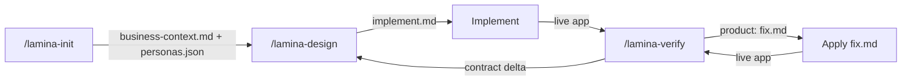
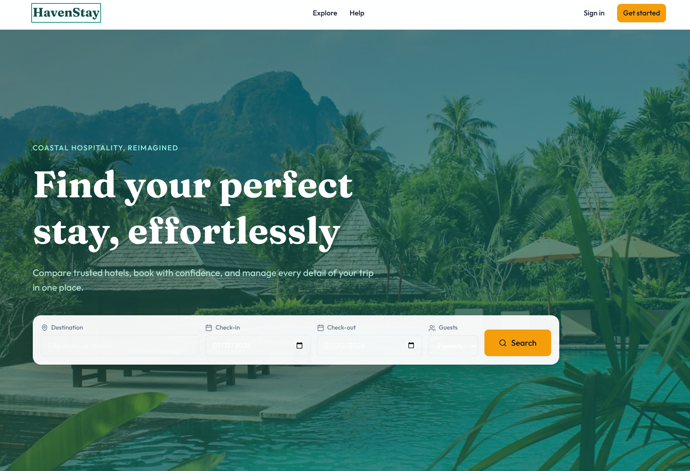

<p align="center">
  
</p>

<p align="center"><em>Design is how it works — not just how it looks.</em></p>

<p align="center">
  Headless product-design skill for AI coding agents. Specs how your app works — states, edges, UX gaps — into a contract your agent implements, then verifies the live build with parallel persona walks. Never writes app source.
</p>

---

**Documentation:** [lamina.dev/docs](https://lamina.dev/docs)

## Quickstart

**SHELL** — install once

```bash
npx skills install aryaniyaps/lamina
```

**AGENT CHAT** — open your project root and start a fresh session

```
/lamina-init <your product domain and primary users>
/lamina-design <one feature or flow>
```

Successful init produces and validates `.lamina/business-context.md` and `.lamina/personas.json`. Later design and verify commands gate on valid `business-context.md`. Run init **once per project or domain**; use `/lamina-init update` only when the business use case, market, scope, or actor cast materially changes.

**ORDINARY CODING MODE** — implement from the handoff

```
Implement from .lamina/runs/<run_id>/implement.md
Start the product
```

**AGENT CHAT**

```
/lamina-verify hall ticket download at http://localhost:3000
```

**ORDINARY CODING MODE** — apply fixes when findings remain

```
Apply .lamina/runs/<run_id>/fix.md
```

**AGENT CHAT**

```
/lamina-verify hall ticket download at http://localhost:3000 again
```

**Design outputs:** `run.json`, `run.md`, `implement.md`. **Verify outputs:** `report.md`, `fix.md`; walkthrough evidence is optional. Open **product** findings go to `fix.md`; **contract** gaps return to `/lamina-design`. **Ops** observations stay in `report.md` only — not applied from `fix.md` and do not block the product/contract exit condition.

Not sure which command to run? `/lamina <what you are trying to do>` is an optional router — not a required setup step.

---

## How it works

Your coding agent writes app source. Optional UI skills handle look and feel. **Lamina owns product behavior** — what to build, how states and flows work, which edges to cover:



| Step | Who | Output |
|------|-----|--------|
| 0. Init | **Lamina** | Validated `.lamina/business-context.md`, `.lamina/personas.json` |
| 1. Design | **Lamina** | `.lamina/runs/<id>/run.json`, `run.md`, `implement.md` |
| 2. Build | **Your coding agent** | App source — any stack |
| 3. Verify | **Lamina** | `report.md`, `fix.md`, optional `walkthrough/` evidence |
| 4. Fix | **Your coding agent** | Product fixes from `fix.md` |
| 5. Re-verify | **Lamina** | Confirm fixes; contract gaps → `/lamina-design`; ops notes stay in `report.md` |

---

## Fits your stack

Lamina slots into whatever you already use. Unopinionated on your tech stack/ AI skills.

| | |
|---|---|
| **Any AI coding tool** | Cursor, Claude Code, Codex, Gemini, Pi, etc |
| **Any framework** | Next.js, Angular, Astro, Svelte, React Native, Flutter, FastAPI, Gin, Express, etc |
| **Any database**  | Postgres, MySQL, MongoDB, Cassandra, Redis, Neo4j, etc |
| **Any Language**  | Javascript, Python, Go, Rust, Elixir, PHP, C#, etc |
| **Any UI library** | TailwindCSS, Chakra UI, shadcn, MUI, etc |
| **Any UI design skill** | Impeccable, UI UX Pro Max, `frontend-design`, etc |
| **Any Workflow skill** | obra/superpowers, mattpocock/skills, everything-claude-code, etc |
| **Any interface** | Websites, Mobile Apps, Desktop, PWAs, Chat Bots, CLIs, etc |

---

## Demo: A Hotel Booking Platform

We built a demo hotel booking platform called HavenStay.
Same prompt, two builds — one with Lamina, one without. Both were built from scratch by **Cursor Composer 2.5** with no human-written app code.

<details>
<summary><strong>The prompt</strong></summary>

```
Design and build a complete hotel booking platform called HavenStay from scratch.

Create a production-ready product that enables travelers to discover, compare, book,
and manage hotel stays, while enabling hotels to manage their properties, rooms,
pricing, availability, reservations, and guest interactions.

The product should feel polished, cohesive, and ready for real-world use. Design every
aspect of the experience, including the end-to-end user journeys, information
architecture, navigation, search and discovery, booking lifecycle, account management,
payments, cancellations, reviews, notifications, hotel management, trust and safety,
customer support, accessibility, edge cases, and system behavior.
```

</details>

| | **With Lamina** | **Without Lamina** |
|---|---|---|
| **Folder** | [`demo/hotel-booking-with-lamina`](demo/hotel-booking-with-lamina) | [`demo/hotel-booking-without-lamina`](demo/hotel-booking-without-lamina) |
| **Workflow** | `/lamina-init` → `/lamina-design` → implement → `/lamina-verify` | Cursor **Plan mode** → implement |

<p align="center">
  
  &nbsp;
  
</p>

<p align="center"><sub>Left: With Lamina · Right: Without Lamina</sub></p>

Both apps cover traveler search/booking, a hotel partner surface, and an admin role. The gap is **product behavior** — marketplace integrity, ops depth, and edge cases — not whether a screen exists.

<details>
<summary><strong>What Lamina Covered (And was missed otherwise)</strong></summary>

- 15-minute checkout inventory hold with countdown, hold-aware availability, and expiry — Plan mode only decrements stock after payment.
- Per-property Flexible / Moderate / Strict cancellation policies with an immutable snapshot at booking — Plan mode uses one global refund tier.
- Property go-live requires admin approve / reject / request-changes — Plan mode lets partners self-publish.
- “List your property” → multi-step onboarding wizard with readiness checklist — Plan mode is flat forms + manual publish.
- Hotel can cancel a reservation with a required reason and automatic full guest refund — Plan mode has no hotel cancel path.
- Full platform admin console (approvals, users, bookings, payments, trust, reviews, tickets, audit) — Plan mode has a single KPI page.
- Traveler edges: email-verified booking gate, cancel flow with refund preview, review-window gating, and receipt on trip detail.
- Search only surfaces live properties and excludes sold-out inventory for the selected dates — Plan mode can still list unavailable hotels.
- Richer booking lifecycle states (`PENDING_PAYMENT`, `CHECKED_IN`, `CANCELLED_BY_TRAVELER` / `_HOTEL`, `PAYMENT_FAILED`) plus user suspension that blocks booking.

</details>

See the [design report](demo/hotel-booking-with-lamina/.lamina/runs/havenstay-platform-2026-07-10/report.md) and [verify report](demo/hotel-booking-with-lamina/.lamina/runs/havenstay-platform-2026-07-10/verify-report.md) for the full contract and findings.

---

## Pair with

Lamina designs and verifies product behavior. It works best when your agent can **see the system cheaply** and **remember prior decisions**:

| Tool/ skill category | Examples | Why |
|---------------|----------|-----|
| **Codebase indexing / semantic code graph** | Graphify, Sourcegraph, code graph/indexing tools | Gives Lamina a queryable view of an existing codebase so it can reason about architecture, trace behavior, and verify designs without repeatedly scanning the entire project. |
| **Persistent memory** | Claude-Mem, Mem0, agent memory systems | Preserves design decisions, assumptions, discoveries, and previous verification results across sessions, reducing repeated work. |
| **Implementation workflows** | obra/superpowers, mattpocock/skills, everything-claude-code | Turns Lamina's design artifacts (such as `implement.md` and `fix.md`) into structured implementation, testing, and review workflows. |
| **UI/UX design tools and skills** | Impeccable, UI UX Pro Max, `frontend-design`, design-focused agents | Produces polished interfaces while Lamina focuses on interaction states, behavior, edge cases, and verification. |
| **Specification-driven engineering** | Spec Kit, Kiro, specification-first workflows | Converts verified designs into implementation plans, tasks, and engineering specifications. |

**Brownfield minimum:** a codebase indexing tool + persistent memory.

---

## Why not …?

Most of these are complementary. Lamina is the contract + verify loop.

### Impeccable, UI UX Pro Max, `frontend-design`

**They polish how it looks.** Lamina designs how it works — actors, flows, empty/error/loading states, invariants. Pair any UI skill; Lamina stays out of pixels.

### BMAD, ai-ux-skills, design-skills

**They teach design judgment** — heuristics, critique, a11y, PRDs. Collections like [BMAD](https://github.com/bmad-code-org/BMAD-METHOD), [ai-ux-skills](https://github.com/firassb/ai-ux-skills), and [design-skills](https://github.com/cuellarfr/design-skills) improve how your agent *thinks*.

**Lamina runs a workflow** — slash commands → `run.json` / `implement.md` → live-app verify. Use craft skills for judgment; Lamina when you need an implementable contract and a post-build check.

### Just asking your coding agent

Fine for happy paths. Weak on permission matrices, stale states, and mid-flow failures. Lamina structures before build and walks the live app after.

### Spec Kit, Kiro, spec-driven dev

**Product first, then spec.** Spec tools structure engineering work; Lamina structures product behavior. Run `/lamina-design`, then feed `implement.md` into Spec Kit/Kiro. Spec tools don't walk your live UI.

### v0, Lovable, Bolt

**They generate apps** — often stack-locked. Lamina doesn't generate code or pick your framework; it fits your repo, agent, and UI stack. Targets role hierarchies, multi-step flows, and domain edges those builders miss.

### Figma / design handoff

Mocks show one screen. They aren't agent instructions and don't verify the build. Lamina outputs `implement.md`, then audits the live product. Coexist fine.

**Choose Lamina** if you're a developer who builds with AI and care about product correctness — not just UI polish.

**Skip it** for landing-page skins, no-code AI builders, or if you don't want a `.lamina/` contract.

---

## Commands

| Command | What it does |
|---------|--------------|
| `/lamina-init` | Domain charter — once per project or domain; `/lamina-init update` for material pivots |
| `/lamina-design` | Design contract → `ready_to_build` with `run.json`, `run.md`, `implement.md` |
| `/lamina-verify` | Post-build check of a named flow/surface at a live URL → `report.md`, `fix.md`, optional walkthrough evidence |
| `/lamina` | Optional router when you are unsure which command to run |

Writes to `.lamina/` only. No app source. No visual styling.

---

## License

Licensed under the [Apache License 2.0](./LICENSE). Copyright 2026 Aryan Iyappan.
