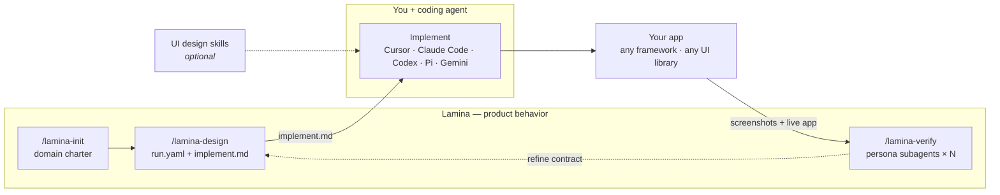

<p align="center">
  
</p>

<p align="center"><em>Design is how it works — not just how it looks.</em></p>

<p align="center"><strong>Know what to build. Iterate faster.</strong></p>

<p align="center">
  Product-design skill for AI coding agents. Specs how your app works — states, edges, UX gaps — into a contract your agent implements, then verifies the live build with parallel persona walks. Never writes app source.
</p>

---

## Install

```bash
npx skills install aryaniyaps/lamina
```

---

## Fits your stack

Lamina slots into whatever you already use. Unopinionated on your tech stack/ AI skills.

| | |
|---|---|
| **Any AI coding tool** | Cursor, Claude Code, Codex, Gemini, Pi |
| **Any framework** | Next.js, Angular, Astro, Svelte, React Native, Flutter, … |
| **Any database**  | Postgres, MySQL, MongoDB, Cassandra, Redis, Neo4j, etc |
| **Any Language**  | Javascript, Python, Golang, Rust, Elixir, C# etc |
| **Any UI library** | Tailwind, Chakra UI, shadcn, MUI, … |
| **Any UI design skill** | Impeccable, UI UX Pro Max, `frontend-design`, your own |
| **Any interface** | Websites, Mobile Apps, Desktop, PWAs, Chat Bots, CLIs, etc |

---

## How it works

Your coding agent writes app source. Optional UI skills handle look and feel. **Lamina owns product behavior** — what to build, how states and flows work, which edges to cover:



| Step | Who | Output |
|------|-----|--------|
| 1. Charter + design | **Lamina** | `.lamina/runs/<id>/run.yaml`, `implement.md` |
| 2. Build | **Your coding agent** | App source — any stack |
| 3. Verify | **Lamina** | Parallel persona walks, findings, invariant checks |

---

## Pair with

Lamina designs and verifies product behavior. It works best when your agent can **see the system cheaply** and **remember prior decisions**:

| Tool | Why |
|------|-----|
| **[Graphify](https://github.com/safishamsi/graphify)** | Queryable codebase map — run `/graphify .` before design/verify on brownfield apps |
| **[Claude-Mem](https://github.com/thedotmack/claude-mem)** | Keeps decisions and findings across sessions |
| **UI design skill** ([Impeccable](https://github.com/pbakaus/impeccable), UI UX Pro Max, `frontend-design`) | Pixels while Lamina owns states, edges, and verify |
| **Spec Kit / Kiro** | Feed `implement.md` into an engineering plan after design |

**Brownfield minimum:** Graphify + Claude-Mem.

---

## Why not …?

Most of these are complementary. Lamina is the contract + verify loop.

### Impeccable, UI UX Pro Max, `frontend-design`

**They polish how it looks.** Lamina designs how it works — actors, flows, empty/error/loading states, invariants. Pair any UI skill; Lamina stays out of pixels.

### BMAD, ai-ux-skills, design-skills

**They teach design judgment** — heuristics, critique, a11y, PRDs. Collections like [BMAD](https://github.com/bmad-code-org/BMAD-METHOD), [ai-ux-skills](https://github.com/firassb/ai-ux-skills), and [design-skills](https://github.com/cuellarfr/design-skills) improve how your agent *thinks*.

**Lamina runs a workflow** — slash commands → `run.yaml` / `implement.md` → live-app verify. Use craft skills for judgment; Lamina when you need an implementable contract and a post-build check.

### Just asking your coding agent

Fine for happy paths. Weak on permission matrices, stale states, and mid-flow failures. Lamina structures before build and walks the live app after.

### Spec Kit, Kiro, spec-driven dev

**Product first, then spec.** Spec tools structure engineering work; Lamina structures product behavior. Run `/lamina-design`, then feed `implement.md` into Spec Kit/Kiro. Spec tools don't walk your live UI.

### v0, Lovable, Bolt

**They generate apps** — often stack-locked. Lamina doesn't generate code or pick your framework; it fits your repo, agent, and UI stack. Targets role hierarchies, multi-step flows, and domain edges those builders miss.

### Figma / design handoff

Mocks show one screen. They aren't agent instructions and don't verify the build. Lamina outputs `implement.md`, then audits the live product. Coexist fine.

**Choose Lamina** if you're a developer who builds with AI and care about product correctness — not just UI polish.

**Skip it** for landing-page skins, no-code AI builders, or if you don't want a `.lamina/` contract.

---

## Quickstart

```
/lamina-init Exam hall ticket system for universities
/lamina-design Hall ticket download with payment gate and venue assignment
# … build with your coding agent …
/lamina-verify
```

Output: `.lamina/runs/<id>/`. Hand `implement.md` to your coding agent.

---

## Commands

| Command | What it does |
|---------|--------------|
| `/lamina` | Router |
| `/lamina-init` | Domain charter |
| `/lamina-design` | Design contract → `ready_to_build` |
| `/lamina-verify` | Post-build check, persona walks, invariants |

Writes to `.lamina/` only. No app source. No visual styling.

---

## More

- Skill router: [`skills/lamina-core/SKILL.md`](skills/lamina-core/SKILL.md)
- Validate a run: `node lib/validate-run.mjs .lamina/runs/<id>/run.yaml`

MIT
