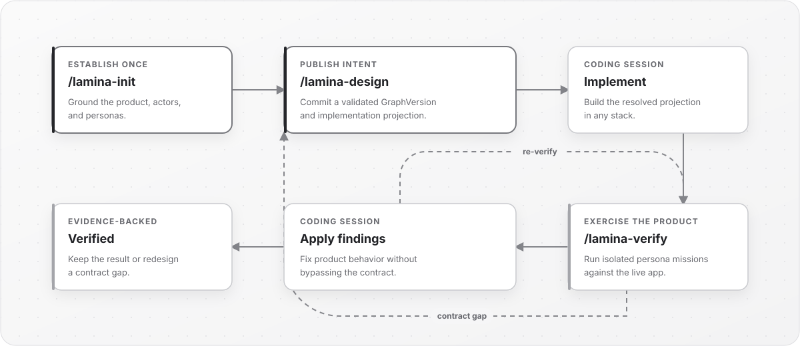

<p align="center">
  
</p>

<p align="center"><em>Design is how it works — not just how it looks.</em></p>

<p align="center">
  Headless product design for AI coding agents, backed by a transactional product graph. Initialize once; then ordinary feature requests automatically give your coding agent the relevant actors, flows, states, permissions, failures, code targets, and proof obligations.
</p>

---

**Documentation:** [lamina.dev/docs](https://lamina.dev/docs)

## Quickstart

### Let your AI agent install it

Open your project root, paste this into your AI coding agent, and let it handle setup:

```text
Install Lamina for this project.

1. Install the standalone Lamina CLI (no Node.js or npm required):
   macOS/Linux: curl -fsSL https://github.com/aryaniyaps/lamina/releases/latest/download/install.sh | sh
   Windows PowerShell: iwr https://github.com/aryaniyaps/lamina/releases/latest/download/install.ps1 -UseBasicParsing | iex
2. Run: lamina doctor --json
3. Install all Lamina skills for this active agent only: use `-a codex` in
   Codex, `-a claude-code` in Claude Code, or `-a cursor` in Cursor. Do not use
   `-a '*'`.
   npx skills add aryaniyaps/lamina --skill '*' -a <active-agent> -y
4. Install passive rules for that provider:
   lamina setup --agent <codex|claude-code|cursor>
5. Node.js/npm are required only for the preceding `npx skills` command. Do not use sudo and do not edit application source during setup. If this is not yet a
   Git project, `/lamina-init` may create Git metadata but must not stage or
   commit files.
6. If a command fails, stop and show me
   the exact error.
7. When complete, report the installed CLI version and agent targets, then tell me to start a fresh agent session and run:
   /lamina-init <your product domain and primary users>
```

Prefer installing it yourself?

```bash
curl -fsSL https://github.com/aryaniyaps/lamina/releases/latest/download/install.sh | sh
npx skills add aryaniyaps/lamina --skill '*' -a <active-agent> -y
lamina setup --agent <codex|claude-code|cursor>
lamina doctor --json
```

The installer downloads the matching CLI and private native CocoIndex worker
from GitHub Releases and verifies both against `SHA256SUMS`. Graph observation
needs no host Node, npm, Python, `uv`, or virtual environment; graphd remains
the only process that owns Ladybug.

The install adds the `lamina` router plus 58 focused workflow and craft skills.
They remain first-class siblings so agents can discover and progressively load
cross-referenced skills directly. Then start a **fresh agent session** so the
complete skill set is available.

### Initialize once, then ask normally

**AGENT CHAT**

```text
/lamina-init <your product domain and primary users>
```

Run init once per project or domain. Use `/lamina-init update` only when the business use case, market, scope, or actors materially change.

On a new folder, init creates `.git` with an unborn `main` branch when needed.
It never stages or creates an initial commit.

**ORDINARY CODING MODE**

```text
Add medication schedule editing with conflict-safe saves and a responsive UI.
```

That is the whole ongoing interface. The installed rules make the agent
implicitly compile a bounded ImplementationPacket from the graph, fill design
gaps, map every requirement to code and tests before editing, implement, run
live proof, fix failures, and reverify. It does not dump the entire graph into
the prompt.

`/lamina-design` and `/lamina-verify` remain advanced overrides when you want a
graph-only design pass or a source-read-only audit. They are not required steps
and Lamina should not recommend them during normal work.

---

## How it works

Your coding agent writes app source. Optional UI skills handle look and feel. **Lamina owns the product-behavior contract** — what to build, how states and flows work, and which failures and edges must be covered.

<p align="center">
  
</p>

| Step | Who | Result |
|---|---|---|
| 0. Init | **Lamina** | Business context plus Product, Actor, and Persona knowledge |
| 1. Prepare | **Lamina + your agent** | Exact graph closure, ranked code context, stable obligations, and a checked WorkMap |
| 2. Build | **Your coding agent** | App source in any stack, mapped to product obligations |
| 3. Verify | **Lamina + your agent** | Independent persona missions plus functional, visual, responsive, and accessibility evidence |
| 4. Fix | **Your coding agent** | Product or contract fixes from failed obligations |
| 5. Re-verify | **Lamina + your agent** | Current evidence for every obligation |

Human-readable implementation, report, and fix documents are optional projections from a resolved `GraphVersion`. They are useful handoffs, but they are not canonical state. Legacy run files are left untouched and have no runtime meaning.

---

## Under the hood

Lamina keeps a local transactional product graph for each Git repository:

- Product intent, observed source behavior, agent inference, persona simulation, and runtime evidence stay separate.
- Multi-part design changes publish atomically: the whole change lands, or none of it does.
- Conflicting facts remain visible as contradictions instead of silently overwriting each other.
- Every relevant persona gets an independent verification mission.
- Lamina's managed observer derives source observations; `graphd` owns the canonical Ladybug graph.

Use `lamina graph status` to inspect the active graph. See the [transactional graph reference](docs/content/reference/transactional-graph.mdx) for Resources, Statements, sessions, GraphVersions, missions, evidence, and the complete CLI.

---

## Fits your stack

Lamina slots into whatever you already use. It is unopinionated about your tech stack and AI tooling.

| | |
|---|---|
| **Any AI coding tool** | Cursor, Claude Code, Codex, Gemini, Pi, etc. |
| **Any framework** | Next.js, Angular, Astro, Svelte, React Native, Flutter, FastAPI, Gin, Express, etc. |
| **Any database** | Postgres, MySQL, MongoDB, Cassandra, Redis, Neo4j, etc. |
| **Any language** | JavaScript, Python, Go, Rust, Elixir, PHP, C#, etc. |
| **Any UI library** | Tailwind CSS, Chakra UI, shadcn/ui, MUI, etc. |
| **Any UI design skill** | Impeccable, UI UX Pro Max, `frontend-design`, etc. |
| **Any workflow skill** | obra/superpowers, mattpocock/skills, everything-claude-code, etc. |
| **Any interface** | Websites, mobile apps, desktop apps, PWAs, chatbots, CLIs, etc. |

---

## Demo: a hotel booking platform

We built a demo hotel booking platform called HavenStay. The same prompt produced two apps — one with Lamina and one without. Both were built from scratch by **Cursor Composer 2.5**, with no human-written app code.

> **Legacy demo:** HavenStay predates the transactional graph runtime. It remains a comparison of Lamina's product-design and verification value, not a guide to the current installation or storage model.

<details>
<summary><strong>The prompt</strong></summary>

```text
Design and build a complete hotel booking platform called HavenStay from scratch.

Create a production-ready product that enables travelers to discover, compare, book,
and manage hotel stays, while enabling hotels to manage their properties, rooms,
pricing, availability, reservations, and guest interactions.

The product should feel polished, cohesive, and ready for real-world use. Design every
aspect of the experience, including the end-to-end user journeys, information
architecture, navigation, search and discovery, booking lifecycle, account management,
payments, cancellations, reviews, notifications, hotel management, trust and safety,
customer support, accessibility, edge cases, and system behavior.
```

</details>

| | **With Lamina** | **Without Lamina** |
|---|---|---|
| **Folder** | [`demo/hotel-booking-with-lamina`](demo/hotel-booking-with-lamina) | [`demo/hotel-booking-without-lamina`](demo/hotel-booking-without-lamina) |
| **Workflow** | `/lamina-init` once → ordinary implementation prompts with passive Lamina context | Cursor Plan mode → implement |

<p align="center">
  
  &nbsp;
  
</p>

<p align="center"><sub>Left: With Lamina · Right: Without Lamina</sub></p>

Both apps cover traveler search and booking, a hotel-partner surface, and an admin role. The gap is **product behavior** — marketplace integrity, operational depth, and edge cases — not whether a screen exists.

<details>
<summary><strong>What Lamina covered — and the other build missed</strong></summary>

- A 15-minute checkout inventory hold with countdown, hold-aware availability, and expiry.
- Per-property cancellation policies with an immutable policy snapshot at booking.
- Admin approval, rejection, or requested changes before a property goes live.
- Multi-step property onboarding with a readiness checklist.
- Hotel cancellation with a required reason and automatic full guest refund.
- A full platform admin surface for approvals, users, bookings, payments, trust, reviews, tickets, and audit.
- Traveler edges such as email verification, refund preview, review-window gating, and receipts.
- Search that excludes unavailable or non-live properties for the selected dates.
- A complete booking lifecycle plus suspension behavior that blocks booking.

</details>

---

## Pair with

Lamina keeps product decisions and verification evidence in one transactional graph. Pair it with tools that implement or polish the resulting contract:

| Tool or skill category | Examples | Why |
|---|---|---|
| **Implementation workflows** | obra/superpowers, mattpocock/skills, everything-claude-code | Turn Lamina's implementation and fix projections into structured coding, testing, and review work. |
| **UI/UX tools and skills** | Impeccable, UI UX Pro Max, `frontend-design`, design-focused agents | Polish the interface while Lamina focuses on behavior, states, permissions, edges, and verification. |
| **Specification-driven engineering** | Spec Kit, Kiro, specification-first workflows | Convert a resolved GraphVersion projection into engineering plans and tasks without making prose canonical product truth. |

---

## Why not …?

Most of these tools are complementary. Lamina is the product contract plus the post-build verification loop.

### Impeccable, UI UX Pro Max, `frontend-design`

**They polish how it looks.** Lamina designs how it works — actors, flows, empty/error/loading states, permissions, invariants, and recovery. Pair any UI skill; Lamina stays out of pixels.

### BMAD, ai-ux-skills, design-skills

**They teach design judgment** — heuristics, critique, accessibility, and PRDs. Lamina runs a workflow: ordinary request → transactional product contract → mapped implementation → live-product verification. Use craft skills for judgment and Lamina when you need a durable contract and evidence-backed check.

### Just asking your coding agent

Fine for happy paths. Weak on permission matrices, stale states, cross-actor handoffs, and mid-flow failures. Lamina structures behavior before the build and exercises the live product afterward.

### Spec Kit, Kiro, spec-driven development

**Product first, then engineering spec.** Lamina structures product behavior and compiles its obligations into the coding context; spec tools can further structure implementation work.

### v0, Lovable, Bolt

**They generate apps** — often within a preferred stack. Lamina does not generate app source or choose your framework. It focuses on the role hierarchies, multi-step flows, state transitions, and domain edges that app generators commonly miss.

### Figma and design handoffs

Mocks show screens. They do not capture every legal state or verify the build. Lamina produces an agent-ready behavior contract and checks the implemented product; visual design tools remain useful alongside it.

**Choose Lamina** if you build with AI and care about product correctness, not just UI polish.

**Skip it** for landing-page skins, no-code generation, or work that does not need an explicit product-behavior contract.

---

## Commands

| Command | What it does |
|---|---|
| `/lamina-init` | Establish the product domain, actors, and personas once per project or domain |
| `lamina setup --agent …` | Install idempotent passive rules for Codex, Claude Code, or Cursor |
| `lamina context catalog` | Explain authoritative graph and derived source-retrieval tiers |
| `lamina work prepare` | Compile the bounded graph slice and stable product obligations |
| `lamina work check` | Require complete requirement-to-code/test mapping before edits |
| `lamina work verify` | Require current evidence for every obligation and all UI audit classes |
| `/lamina-design` | Advanced graph-only design override |
| `/lamina-verify` | Advanced source-read-only verification override |

The Lamina CLI does not edit application source or prescribe visual styling;
the coding agent implements only after the WorkMap gate passes.

---

## Development

```bash
corepack pnpm install --frozen-lockfile
corepack pnpm test
```

The standalone CLI and matching private native CocoIndex worker are published
as checksum-verified assets on the [GitHub Releases page](https://github.com/aryaniyaps/lamina/releases).

## License

Licensed under the [Apache License 2.0](./LICENSE). Copyright 2026 Aryan Iyappan.
