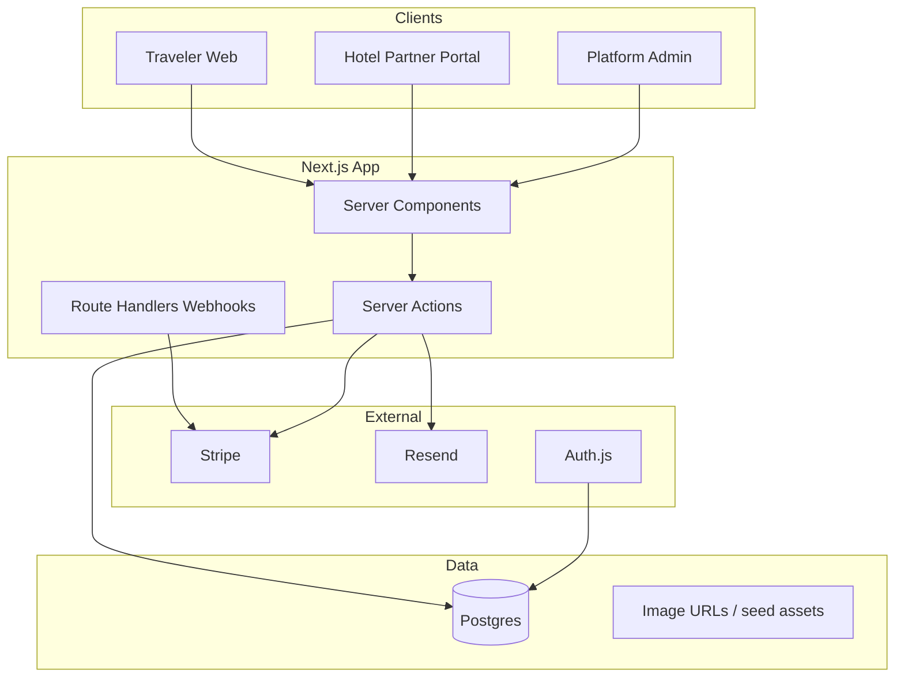

# HavenStay Hotel Booking Platform

## Product

**HavenStay** is a dual-sided marketplace: travelers discover and book stays; hotels manage inventory, pricing, and reservations. Brand direction: coastal hospitality — deep teal primary, warm amber CTAs, mist/gradient atmospheres, expressive type (e.g. Fraunces + Outfit). No purple gradients, no cream/terracotta cliché, no card-heavy dashboards on marketing surfaces.

**Path:** [`~/web-projects/havenstay`](~/web-projects/havenstay)  
**Stack:** Next.js 15 (App Router) · TypeScript · Tailwind · Prisma · Postgres (Neon or local Docker) · Auth.js (credentials + Google) · Stripe Checkout + webhooks · Resend (email) · Zod · Server Actions

## Architecture

**Roles:** `GUEST` · `HOTEL_OWNER` · `HOTEL_STAFF` · `ADMIN`  
Route groups: `(marketing)`, `(guest)`, `(partner)`, `(admin)`, `(auth)`.

## Domain model (Prisma)

Core entities:

- **User** — profile, role, auth accounts
- **Hotel** — name, slug, location, amenities, photos, policies, status (`DRAFT`/`PUBLISHED`/`SUSPENDED`)
- **RoomType** — capacity, beds, amenities, base price, photos
- **InventoryDay** — roomType + date → available count, price override
- **Booking** — guest, hotel, roomType, dates, guests, status (`PENDING_PAYMENT`/`CONFIRMED`/`CANCELLED`/`COMPLETED`/`NO_SHOW`), totals, Stripe IDs, cancellation policy snapshot
- **Payment** — amount, status, Stripe session/intent refs
- **Review** — rating, text, stay verification, moderation
- **MessageThread / Message** — guest ↔ hotel on a booking
- **Notification** — in-app + email log
- **SupportTicket** — FAQ-backed help + ticket form
- **Report** — trust/safety flag on hotel/review/user

Availability rule: confirm only if `InventoryDay.available >= 1` for every night; decrement on confirm; restore on cancel. Price = sum of nightly rates (override or base) + taxes/fees (simple % + flat service fee).

## Information architecture

**Traveler**

| Area | Routes |
|------|--------|
| Discover | `/`, `/search`, `/hotels/[slug]` |
| Book | `/hotels/[slug]/book` → Stripe → `/bookings/[id]/confirmation` |
| Trips | `/trips`, `/trips/[id]` (cancel, message, review) |
| Account | `/account`, `/account/notifications` |
| Trust | `/help`, `/help/[slug]`, `/policies/*`, report actions |

**Hotel partner** (`/partner/...`, owner/staff only)

| Area | Routes |
|------|--------|
| Overview | `/partner` dashboard (occupancy, upcoming arrivals) |
| Property | `/partner/hotel`, photos, amenities, policies |
| Rooms | `/partner/rooms`, `/partner/rooms/[id]` |
| Calendar | `/partner/calendar` — availability + price by date |
| Reservations | `/partner/reservations`, `/partner/reservations/[id]` |
| Messages | `/partner/messages` |
| Reviews | `/partner/reviews` |

**Admin:** `/admin` — hotels moderation, users, reports, bookings overview.

## End-to-end journeys (v1)

1. **Search → book:** destination + dates + guests → filtered results (price, rating, amenities, free cancel) → hotel detail → room select → guest details → Stripe Checkout → webhook confirms → email + trips.
2. **Manage stay:** view confirmation, cancel within policy (full/partial refund via Stripe), message hotel, leave review after checkout date.
3. **Hotel ops:** onboard property → add room types → set calendar inventory/pricing → publish → receive booking notifications → confirm/check-in status → reply to messages → respond to reviews.
4. **Edge cases:** sold-out race (transaction + recheck), payment abandoned (`PENDING_PAYMENT` TTL cleanup), past-date search blocked, min-stay/max guests validation, double-submit idempotency keys, cancelled booking cannot re-cancel.

## UX / design system

- Global CSS variables for teal/amber/mist palette; Fraunces (display) + Outfit (UI).
- Marketing/home: one full-bleed hero composition (brand + headline + search CTA + dominant imagery) — no card grids in hero.
- Search results: list + map-ready layout (map optional stub); filters as clear controls, not pill spam.
- Partner UI: dense but calm operational layout (tables/calendar OK here).
- Motion: subtle hero fade/slide, search bar focus, booking progress transitions (2–3 intentional motions).
- A11y: semantic landmarks, focus rings, form labels, keyboard calendar, sufficient contrast, `prefers-reduced-motion`.

## Implementation phases

### Phase 0 — Bootstrap
- `create_project` + `move_agent_to_root` → `~/web-projects/havenstay`
- `create-next-app` (TS, App Router, Tailwind, ESLint)
- Prisma schema + migrate; `.env.example` (`DATABASE_URL`, `AUTH_SECRET`, Google OAuth optional, `STRIPE_*`, `RESEND_API_KEY`, `NEXT_PUBLIC_APP_URL`)
- Seed: 8–12 hotels across cities, room types, 90 days inventory, demo guest + hotel owner accounts
- Design tokens + shared layout/nav/footer components

### Phase 1 — Auth & accounts
- Auth.js credentials + optional Google; role on User
- Sign-in/up, session middleware protecting `/partner`, `/admin`, `/trips`, `/account`
- Account profile edit

### Phase 2 — Discovery
- Home with branded hero + destination search
- `/search` with query params (location, checkIn, checkOut, guests, filters)
- Hotel detail: gallery, amenities, rooms with live availability for selected dates, policies, reviews
- Server-side search queries indexed by city/name

### Phase 3 — Booking & payments
- Booking draft → Stripe Checkout Session
- Webhook: `checkout.session.completed` → confirm booking, decrement inventory, notify
- Confirmation page + email (Resend; console fallback if no key)
- Cancellation with policy engine + Stripe refund
- Trips list/detail

### Phase 4 — Partner portal
- Hotel CRUD (one primary hotel per owner in v1)
- Room type CRUD + image URLs
- Calendar grid: set available count + nightly price
- Reservations inbox + status updates
- Guest messaging threads
- Lightweight analytics (bookings count, revenue, occupancy %)

### Phase 5 — Reviews, trust, support, polish
- Post-stay reviews (verified booking only); hotel response
- Report hotel/review; admin queue
- Help center + support ticket form
- In-app notification center
- Empty/error/loading states; SEO metadata; README with setup

## Payments & notifications behavior

- **Pay:** Stripe Checkout (card); amounts in smallest currency unit; store `stripeSessionId` / `paymentIntentId`
- **Refunds:** policy windows (e.g. free cancel ≥48h before check-in; 50% within 48h; no refund after check-in) — snapshot policy on booking
- **Emails:** booking confirmed, cancelled, reminder (optional cron stub), new message, review request
- **Dev mode:** without Stripe keys, allow “Simulate payment” path that confirms booking locally (clearly labeled) so the product is demoable offline

## Out of v1 (explicitly deferred)

Channel managers, multi-property chains at scale, loyalty, live agent chat, native apps, complex multi-jurisdiction tax, real map tiles provider (layout ready), AI recommendations.

## Success criteria

- Seeded demo: search → book (Stripe or simulate) → see trip → cancel with refund rules
- Hotel owner: edit rooms/calendar → see reservation → message guest
- Polished, cohesive UI on mobile and desktop; no broken primary paths
- README documents env setup, seed logins, and demo flow
