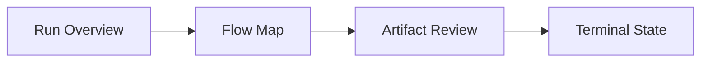

# Flow Pack

```mermaid
flowchart LR
  Start[Run Overview] --> FlowMap[Flow Map]
  FlowMap --> Artifact[Artifact Review]
  Artifact --> Terminal[Terminal State]
```

## Coverage

| Flow | Screens | Notes |
| --- | ---: | --- |
| onboarding | 4 | Branches from overview to artifact review. |
| recovery | 3 | Exercises persona blocker state. |
