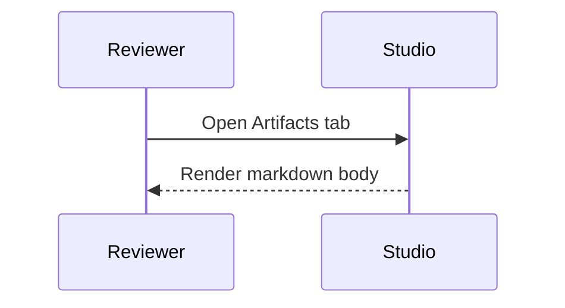

# Markdown Renderer Pack

This artifact checks GFM and code rendering.

- Bulleted list
- `inline code`
- A table below

| Column | Value |
| --- | --- |
| Confidence | medium |
| Evidence mode | assumption_allowed |

