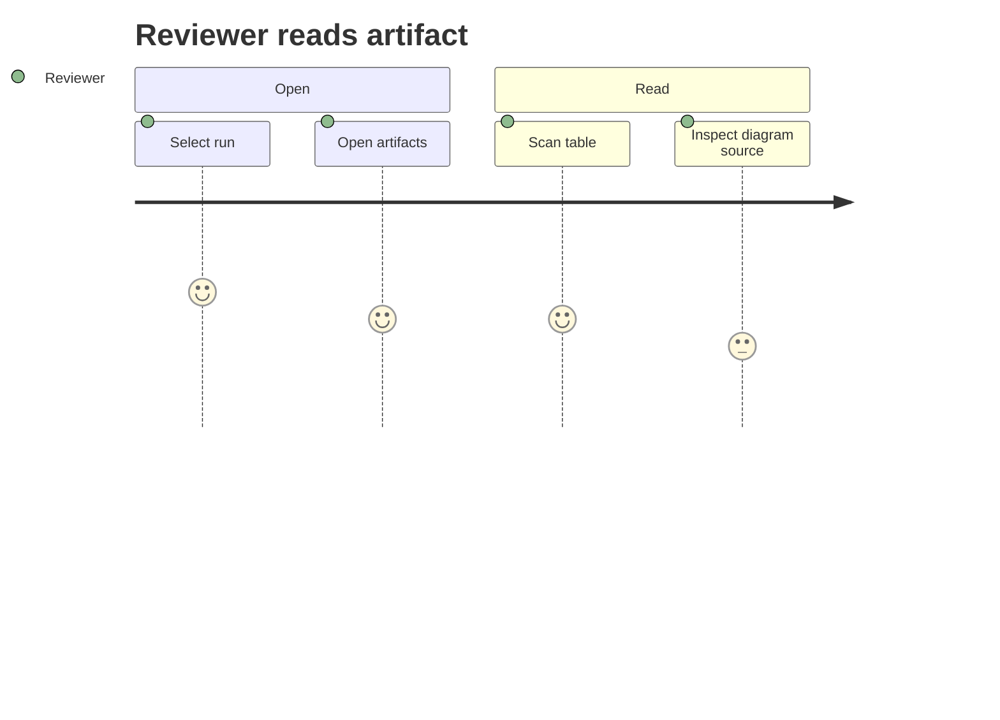

# Dense Artifact

## Findings

- Finding A has **bold emphasis**.
- Finding B has `inline code`.
- Finding C includes a link-like reference: [Lamina](https://example.com).

| Scenario | Risk | Status |
| --- | --- | --- |
| Mermaid block | Rendered as source card | Expected |
| Long table | Horizontal fit | Expected |

