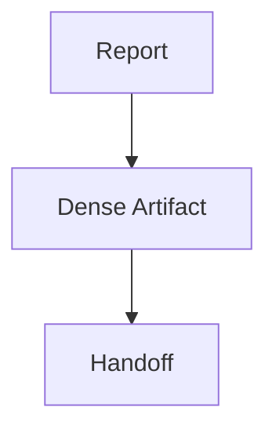

# Markdown Heavy Report

> This report exists to stress the markdown renderer.

## Checklist

1. Headings have readable spacing.
2. Tables stay within the document pane.
3. Code blocks preserve monospace formatting.

| Token | Meaning |
| --- | --- |
| `P0` | Must fix |
| `P1` | Should fix |

